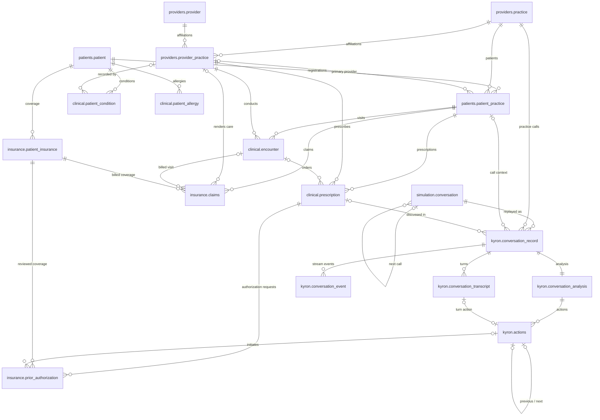
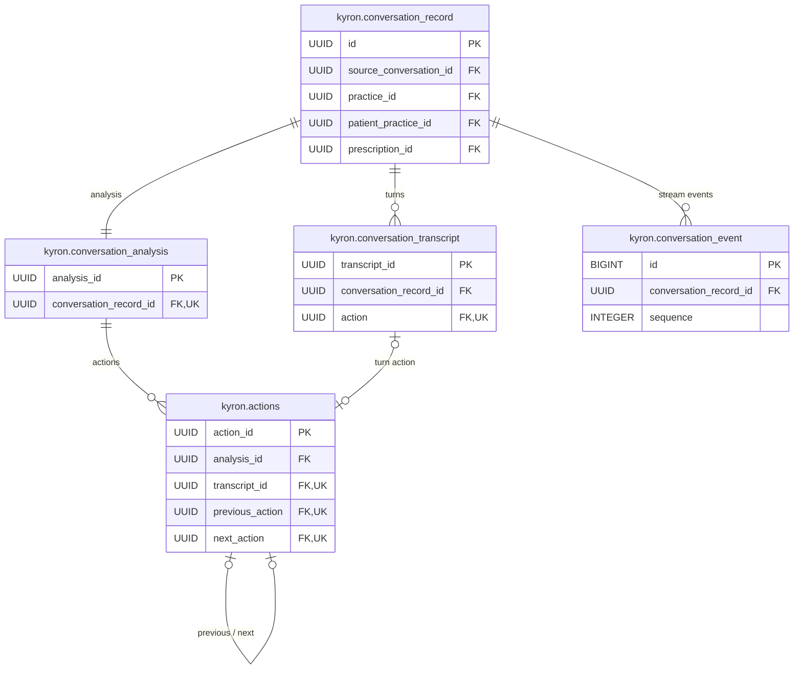
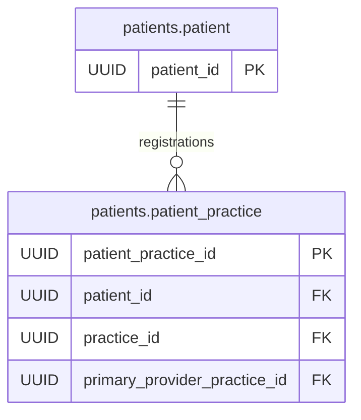
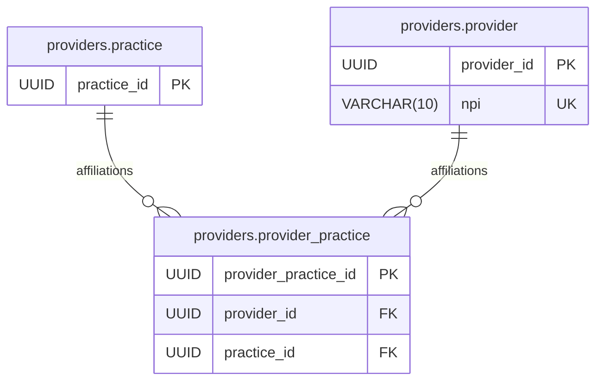
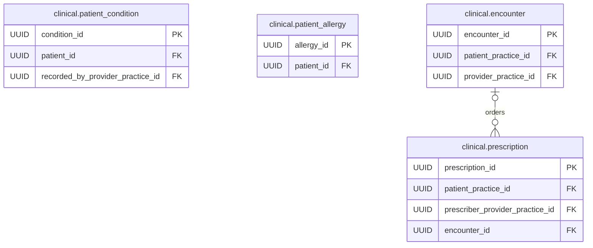
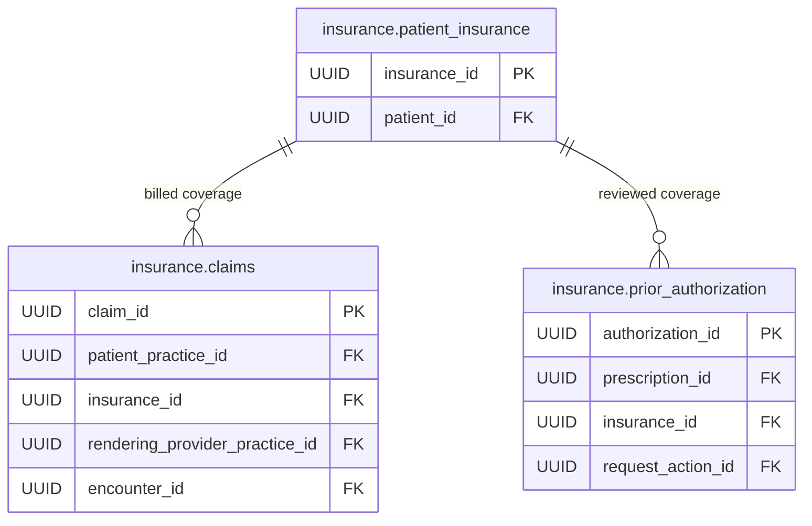
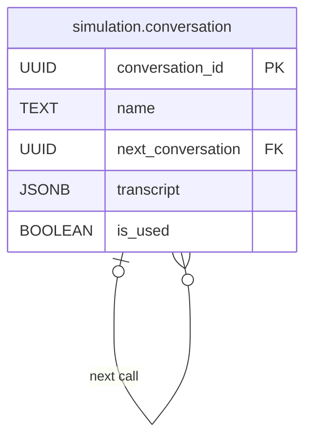

# kyron assessment

## Run locally

```sh
docker compose up --build -d --wait
```

Open [localhost:5173](http://localhost:5173), select a practice, and sign in at `/{practice}/auth`. The seeded username is **taylor.demo** and the password is **password**. A valid HttpOnly JWT cookie restores your session for that practice; signing out clears it. API docs remain at [localhost:8000/docs](http://localhost:8000/docs).

The React client currently provides authentication and a protected practice landing page. Conversation streaming and simulation endpoints are available under `/api/practices/{practice}` with practice-scoped authentication. Local secrets are configured in the gitignored `.env`; see [auth setup](server/README.md#provider-authentication) for new checkouts.

Compose starts PostgreSQL, FastAPI, the simulator, and the Vite client. Startup seeds **five named scenarios / fifteen linked calls** plus fictional practice, provider, patient, and prescription context. Existing data and used flags survive restarts. See [server setup and endpoints](server/README.md).

Here is my submission for the Kyron take home assessment. Here is my initial plan:

## Part 1 — Model the Evaluation Problem

I am choosing to evaluate and end to end workflow of a patient calling the Kyron AI agent for a prescription, and then the agent calling the insurance agency to request prior authorization. I need to evaluate the following success goals:
- Does the agent understand the goal?
- Does the agent flow from step 1 to step 2?
- Does the agent complete the goal(s)?

And when the agent does not complete any of these:
- When and why did it not understand the goal?
- When and why did the agent not complete the follow up task?
- Why did the agent not complete the given task?
- Are there any follow ups to a failed task?

I don't think that I can explore the why with the scope of this task, so instead I will focus on the when. When a task is failed, I need to make sure that the proper procedures are in place to rectify the mistake, or atleast notify the proper channels when there is a mismatch. Whether I am able to complete everything will be evaluated at the end.

## Part 2 — Build a Replay or Simulation Harness

I don't know of any datasets that can be relevant, and I don't want to waste the time searching for the perfect dataset, so I am going to generate one with an LLM. I am going to simulate patient to AI call transcripts for this task. I will probably model this dataset by storing a record of conversations, and within each conversation, record transcripts. I think that I will model it with a one to many relationship of one conversation record to many transcripts. Every row in this transcript table is going to be a turn by one of the participants. I am also going to simulate out of order speaking turns. This could potentially get messy, but that is good, since that will simulate potential reasons for failures.

One option I may do is have a simulation dataset off to the side, where I will simulate a realtime conversation. I could make a tool that grabs a conversation from a table, plays it out in real time (sending transcript data somehow to the backend), and simulating decisions it makes.

## Part 3 — Decide What to Measure

I will need an additional table for conversation metrics. Once a conversation is running, I will need to record down in real time what steps the AI is making, and the ultimate decision. I will try to see if I can use these metrics to simulate decisions of the AI. These metrics will check for understanding of the task, appropriate next steps, and maybe time to completion.

## Database design

The database uses six schemas for recorded conversations, patients, providers, clinical records, insurance, and replay input. The overview shows every table and relationship. Each schema section shows its keys and columns.

### Complete ERD



`||` = exactly one, `o|` = zero or one, and `o{` = zero or many. `simulation.conversation` stores linked source calls; each replay creates runtime records in `kyron`.

### Reading the schema definitions

`PK` marks a primary key, `FK` a foreign key, and `UK` a unique column. IDs use `UUID`; timestamps use `TIMESTAMPTZ`. Columns sharing a type are grouped to keep the tables compact. Schema ERDs show local relationships; the complete ERD shows links across schemas. The definitions below are the implementation scope.

### `kyron` schema

Stores calls, individual speaking turns, one analysis per call, and agent actions. Every call belongs to a practice through required `practice_id` (FK → `providers.practice.practice_id`). `patient_practice_id` and `prescription_id` are nullable until identified. When populated, the registration and prescription must belong to the conversation’s practice.



#### `kyron.conversation_record`

| Type | Columns |
| --- | --- |
| `UUID` | `id` (PK)<br>`source_conversation_id` (FK)<br>`practice_id` (FK)<br>`patient_practice_id` (FK)<br>`prescription_id` (FK) |
| `TIMESTAMPTZ` | `start_time`<br>`end_time` |
| `TEXT` | `name`, `status` |
| `INTEGER` | `last_sequence` |

`source_conversation_id` references `simulation.conversation.conversation_id`. `status` progresses from `live` to `ended` to `completed`; `last_sequence` enforces ordered events.

#### `kyron.conversation_transcript`

| Type | Columns |
| --- | --- |
| `UUID` | `transcript_id` (PK)<br>`conversation_record_id` (FK)<br>`action` (FK, UK) |
| `TEXT` | `speaker`<br>`transcript` |
| `INTEGER` | `turn_index`, `last_word_index` |
| `TIMESTAMPTZ` | `start_time`<br>`end_time` |

#### `kyron.conversation_analysis`

| Type | Columns |
| --- | --- |
| `UUID` | `analysis_id` (PK)<br>`conversation_record_id` (FK, UK) |
| `TEXT` | `overall_sentiment`<br>`reason_for_call` |

#### `kyron.actions`

| Type | Columns |
| --- | --- |
| `UUID` | `action_id` (PK)<br>`analysis_id` (FK)<br>`transcript_id` (FK, UK)<br>`previous_action` (FK, UK)<br>`next_action` (FK, UK) |
| `TEXT` | `action`<br>`reason` |
| `BOOLEAN` | `is_completed` |

#### `kyron.conversation_event`

| Type | Columns |
| --- | --- |
| `BIGINT` | `id` (PK, generated) |
| `UUID` | `conversation_record_id` (FK) |
| `INTEGER` | `sequence` |
| `JSONB` | `data` |

This append-only event log drives browser SSE and restores the transcript after refresh. (`conversation_record_id`, `sequence`) is unique. Sequence 0 stores creation metadata; subsequent events start at 1. The global `id` is the SSE resume cursor.

Create each conversation and its analysis together. `is_completed` defaults to false. Patient/prescription context, unfinished end times, and analysis results not yet assessed are nullable; `practice_id` is required. An action always belongs to an analysis; its transcript link is nullable for actions after the call. `conversation_transcript.action` and `actions.transcript_id` are reciprocal unique links. `previous_action` and `next_action` are nullable unique links to `actions.action_id`.

### `patients` schema

Stores demographics and practice registrations. Each registration links one patient to one practice and holds that practice’s medical record number.



#### `patients.patient`

| Type | Columns |
| --- | --- |
| `UUID` | `patient_id` (PK) |
| `TEXT` | `first_name`, `last_name`, `preferred_name`<br>`sex_assigned_at_birth`, `gender_identity`, `pronouns`<br>`race`, `ethnicity`<br>`preferred_language`<br>`phone`, `email`<br>`address`, `city`, `state`, `postal_code`, `country`<br>`preferred_contact_method` |
| `DATE` | `date_of_birth` |
| `BOOLEAN` | `interpreter_required` |

#### `patients.patient_practice`

| Type | Columns |
| --- | --- |
| `UUID` | `patient_practice_id` (PK)<br>`patient_id` (FK)<br>`practice_id` (FK)<br>`primary_provider_practice_id` (FK) |
| `TEXT` | `medical_record_number`<br>`status` |
| `DATE` | `registration_date` |

Enforce uniqueness on (`patient_id`, `practice_id`) and (`practice_id`, `medical_record_number`). `primary_provider_practice_id` is nullable and references `providers.provider_practice`. Preferred name, self-reported demographic fields, and unavailable contact details are nullable. Age is derived from `date_of_birth` at the call date.

### `providers` schema

Stores clinicians, practices, and their affiliations. Each practice has one address. A provider can work at multiple practices.



#### `providers.practice`

| Type | Columns |
| --- | --- |
| `UUID` | `practice_id` (PK) |
| `TEXT` | `name`<br>`address`<br>`city`, `state`, `postal_code`, `country`<br>`specialty`<br>`phone`, `fax`<br>`timezone` |
| `BOOLEAN` | `is_active` |

#### `providers.provider`

| Type | Columns |
| --- | --- |
| `UUID` | `provider_id` (PK) |
| `VARCHAR(10)` | `npi` (UK) |
| `TEXT` | `first_name`, `last_name`<br>`credentials`<br>`specialty`<br>`license_number`, `license_state`<br>`phone`, `email` |
| `BOOLEAN` | `is_active` |

#### `providers.provider_practice`

| Type | Columns |
| --- | --- |
| `UUID` | `provider_practice_id` (PK)<br>`provider_id` (FK)<br>`practice_id` (FK) |
| `TEXT` | `role` |
| `DATE` | `start_date`, `end_date` |
| `BOOLEAN` | `accepting_new_patients` |

`npi` is a unique, nullable 10-digit provider identifier stored as text; `provider_id` remains the internal key. License details and affiliation end dates are nullable. [CMS: NPI standard](https://www.cms.gov/regulations-and-guidance/administrative-simplification/nationalprovidentstand).

### `clinical` schema

Stores patient conditions, allergies, visits, and prescription orders. Visits and prescriptions reference a patient registration and a provider affiliation.



#### `clinical.patient_condition`

| Type | Columns |
| --- | --- |
| `UUID` | `condition_id` (PK)<br>`patient_id` (FK)<br>`recorded_by_provider_practice_id` (FK) |
| `TEXT` | `code_system`, `diagnosis_code`, `description`<br>`clinical_status` |
| `DATE` | `onset_date`, `resolved_date` |
| `TIMESTAMPTZ` | `recorded_at` |

#### `clinical.patient_allergy`

| Type | Columns |
| --- | --- |
| `UUID` | `allergy_id` (PK)<br>`patient_id` (FK) |
| `TEXT` | `substance`, `reaction`, `severity`<br>`verification_status` |
| `TIMESTAMPTZ` | `recorded_at` |

#### `clinical.encounter`

| Type | Columns |
| --- | --- |
| `UUID` | `encounter_id` (PK)<br>`patient_practice_id` (FK)<br>`provider_practice_id` (FK) |
| `TEXT` | `encounter_type`<br>`reason_for_visit`, `clinical_summary`<br>`status` |
| `TIMESTAMPTZ` | `start_time`, `end_time` |

#### `clinical.prescription`

| Type | Columns |
| --- | --- |
| `UUID` | `prescription_id` (PK)<br>`patient_practice_id` (FK)<br>`prescriber_provider_practice_id` (FK)<br>`encounter_id` (FK) |
| `TEXT` | `medication_name`, `strength`, `dose`, `route`, `frequency`<br>`quantity_unit`<br>`pharmacy_name`, `pharmacy_phone`<br>`status` |
| `NUMERIC(10,2)` | `quantity` |
| `INTEGER` | `days_supply`, `refills_authorized`, `refills_remaining` |
| `TIMESTAMPTZ` | `written_at`, `expires_at` |

Condition attribution (`recorded_by_provider_practice_id`), unknown diagnosis codes and dates, prescription encounter links, and unfinished end times are nullable. Unknown allergy reactions and severity are nullable; no allergy rows means no recorded allergy information. `recorded_at` controls when health information becomes available during replay.

### `insurance` schema

Stores patient coverage, claim totals, and medication authorization requests. Payer contact details live on the coverage record. Authorization requests exist independently of claims.



#### `insurance.patient_insurance`

| Type | Columns |
| --- | --- |
| `UUID` | `insurance_id` (PK)<br>`patient_id` (FK) |
| `TEXT` | `payer_name`, `plan_name`, `plan_type`<br>`member_id`, `group_number`<br>`subscriber_name`, `relationship_to_subscriber`<br>`authorization_phone` |
| `DATE` | `coverage_start`, `coverage_end` |
| `INTEGER` | `coverage_priority` |

#### `insurance.claims`

| Type | Columns |
| --- | --- |
| `UUID` | `claim_id` (PK)<br>`patient_practice_id` (FK)<br>`insurance_id` (FK)<br>`rendering_provider_practice_id` (FK)<br>`encounter_id` (FK) |
| `TEXT` | `payer_claim_number`<br>`claim_type`<br>`status`<br>`denial_code`, `denial_reason` |
| `DATE` | `service_start_date`, `service_end_date` |
| `TIMESTAMPTZ` | `submitted_at`, `adjudicated_at` |
| `NUMERIC(12,2)` | `billed_amount`, `allowed_amount`, `paid_amount`, `patient_responsibility` |
| `VARCHAR(3)` | `currency` |

#### `insurance.prior_authorization`

| Type | Columns |
| --- | --- |
| `UUID` | `authorization_id` (PK)<br>`prescription_id` (FK)<br>`insurance_id` (FK)<br>`request_action_id` (FK) |
| `TEXT` | `payer_reference_number`<br>`status`<br>`decision_reason` |
| `TIMESTAMPTZ` | `submitted_at`, `decided_at` |
| `DATE` | `valid_from`, `valid_until` |

Claim provider and encounter links, group numbers, coverage end dates, payer references, pending decision fields, and unknown amounts are nullable. `request_action_id` is a nullable link to `kyron.actions`. Amounts use `NUMERIC(12,2)` and `currency` stores the currency code. Each claim row contains the totals for one claim.

### `simulation` schema

Stores complete source conversations for replay in a single table. The harness selects an unused conversation and sets `is_used` to true after replay completes.



#### `simulation.conversation`

| Type | Columns |
| --- | --- |
| `UUID` | `conversation_id` (PK)<br>`next_conversation` (FK, nullable) |
| `TEXT` | `name` |
| `JSONB` | `transcript` |
| `BOOLEAN` | `is_used` |

`transcript` is a required JSON object containing `metadata` (practice, patient registration, and prescription links), ordered `turns` (speaker, text, pauses, word timing, and at most one action per turn), and `after_call_actions`. Links inside JSON are validated by the receiving server, not database foreign keys. `is_used` is required and defaults to false. `conversation_id` is the source ID; runtime calls have their own `kyron.conversation_record.id`. `next_conversation` references another `simulation.conversation.conversation_id`. Random selection excludes follow-up rows; replay follows the links until null and rejects cycles. Each completed call commits its used flag separately. The `name` identifies the scenario and call stage. See the [payload example](simulator/example_conversation.json) and [simulator setup](simulator/README.md).

### Data integrity

- Foreign keys must resolve to records for the same patient and practice. Provider affiliations must match the practice on the registration, visit, prescription, or claim.
- Action/transcript links must be reciprocal and belong to the same conversation. Previous/next action links must be reciprocal, remain within one analysis, and contain no self-links or cycles.
- Create the conversation and its analysis in one transaction. Enforce cross-record consistency and reciprocal links with deferred database triggers.
- End dates and times cannot precede their corresponding starts. Quantities, refill counts, and monetary amounts cannot be negative.
- Replay exposes only information available at the simulated time; future insurer decisions remain in the simulator until they occur.


## Part 4 — Build the Full-Stack Product

Health care often has rules based decisions and structured workflows. It is not uncommon to see something like this, especially in the insurance space. Therefore, here is how I am going to do this.

I will have a simulation package that runs the simulations. It will grab a random, unused conversation from the simulation table, and stream the data to the server in real time, and realisttically. 

The server will have an endpoint for triggering this. It will also have an endpoint for resetting, which truncates the kyron conversation tables and resets all simulation conversations to unused. I will also have an endpoint to pick a specific simulation conversation. 

The server will take this data and place it into conversation tables as it runs. One line at a time, it created the conversation record and transcript with potential actions or inactions. This information will be processed in the server, and streamed to the frontend via SSE for realtime updates.

The client will have an api for the server. It will feature a dashboard of past conversations ordered by call date and time. I will also have an "auth" screen where I can log in as different providers for their practices. This should filter down the conversation logs by patients in that practice to show a kind of multitenancy.

The dashboard will feature a table that shows the conversation history, but also any ongoing calls. Calls ongoing will be at the top of the table, as they should since they will technically be the most recent. I am going to have an additional view where its still ordered by date time, but any related conversations (any conversations with actions that are linked to another conversation) should be grouped together, with the first call being the row, and an expand to show the next call(s). Clicking on a row will bring up converation information in either a modal or drawer, im not sure yet. 

Here is the part that's important. I need some kind of analysis of a conversation and the actions taken. I think after a call is completed, I will need to runs some analysis of it. I need to understand the goal, reasons, and next actions. The next actions will be from a predefined list of actions. I think what I'm going to do is im going to run the transcript through an LLM to evaluate this. It will extract the goal, reason, and next action. What it wont know, is some ground truth. I am modeling this as some predefined steps, and if the AI does not get that right, it should be flagged as a wrong case. Wrong cases will have some visual indicator in the row. Since this is just for the one workflow, I will only make this app work for this.

I will use AI assisted coding for this because I only have 8 hours. Otherwise I would only be able to do the simulation and some server in time.

## Simulator app

The background Python app in [`simulator/`](simulator/README.md) waits for `POST /trigger`, locks a random unused starting conversation, creates the server conversation with metadata, and streams words and simulated actions in order. It then follows `next_conversation` links using specific-ID lookup. `GET /status` reports the active call and completed calls. It marks each source used only after the server acknowledges that call’s full replay.
